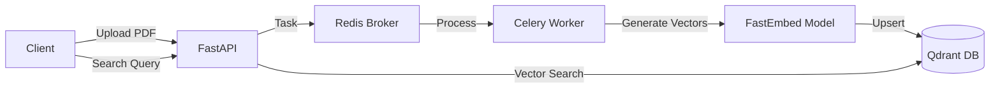

# 🧠 RAG Backend Core

A production-ready, Dockerized backend for **Retrieval-Augmented Generation (RAG)** systems. This project implements an asynchronous document ingestion pipeline and a semantic search engine using local embeddings, ensuring data privacy and high performance without relying on external APIs for vectorization.

## 🚀 Features

* **Asynchronous Ingestion Pipeline:** Uses **Celery** and **Redis** to process heavy PDF documents in the background without blocking the main API.
* **Vector Database Integration:** Fully integrated with **Qdrant** for high-speed vector storage and retrieval.
* **Local Embeddings:** Utilizes **FastEmbed** (`BAAI/bge-small-en-v1.5`) running locally on CPU. No OpenAI API keys required for this stage.
* **Modern Architecture:** Built with **FastAPI** and strict typing (Pydantic).
* **Dependency Management:** Solved complex compatibility issues between `langchain` and `qdrant-client` using strict version pinning.
* **Containerized:** Fully reproducible environment using **Docker Compose**.

## 🛠️ Tech Stack

* **Language:** Python 3.11
* **Framework:** FastAPI
* **Task Queue:** Celery + Redis
* **Vector DB:** Qdrant
* **Orchestration:** LangChain (via `langchain-qdrant`)
* **Embeddings:** FastEmbed
* **Infrastructure:** Docker & Docker Compose

## 🏗️ Architecture



## 📦 Installation & Setup

1. **Clone the repository:**
   ```bash
   git clone https://github.com/jonnamartiinUdemm/rag-backend-core
   cd rag-backend-core
   ```

2. **Build and Start Services:**
   Make sure you have Docker Desktop running.
   ```bash
   docker compose up -d --build
   ```

3. **Verify Status:**
   Ensure all 4 containers (web, worker, redis, qdrant) are up:
   ```bash
   docker compose ps
   ```

## 🔌 API Usage

The API provides interactive documentation via Swagger UI at `http://localhost:8000/docs`.

### 1. Upload a Document (Async)
Uploads a PDF to be processed by the background worker.

* **Endpoint:** `POST /documents/upload`
* **Content-Type:** `multipart/form-data`

### 2. Semantic Search
Retrieves the most relevant text chunks based on the meaning of your query, not just keyword matching.

* **Endpoint:** `POST /chat/search`
* **Body:**
    ```json
    {
      "query": "What is the conclusion of the study?",
      "top_k": 3
    }
    ```
* **Response Example:**
    ```json
    {
      "results": [
        {
          "content": "...text extracted from PDF...",
          "metadata": {"source": "study.pdf", "page": 10},
          "similarity_score": 0.85
        }
      ]
    }
    ```

## 🔧 Project Structure

```bash
rag-backend-core/
├── app/
│   ├── api/
│   │   └── routes/         # API Endpoints (Chat, Documents)
│   ├── core/               # Configuration & Settings
│   ├── data/               # Persistent storage for Qdrant/Redis
│   ├── services/           # Business logic
│   ├── tasks/              # Celery tasks (ingestion logic)
│   └── main.py             # App entry point
├── docker-compose.yml      # Infrastructure definition
├── Dockerfile              # Python environment definition
└── requirements.txt        # Pinned dependencies
```

## 🐛 Troubleshooting & Notes

* **Dependency Conflict Solved:** This project explicitly uses `qdrant-client==1.9.1` and `langchain-qdrant==0.1.0` to resolve the `AttributeError: 'QdrantClient' object has no attribute 'search'` known issue in older LangChain community wrappers.
* **Cold Start:** The first time you run an ingestion or search, the system will download the embedding model (approx. 200MB). This happens automatically inside the container.

## 🔜 Roadmap

* [x] Document Ingestion (PDF)
* [x] Vector Database Setup
* [x] Semantic Search API
* [ ] LLM Integration (Generation Phase)
* [ ] Frontend UI
